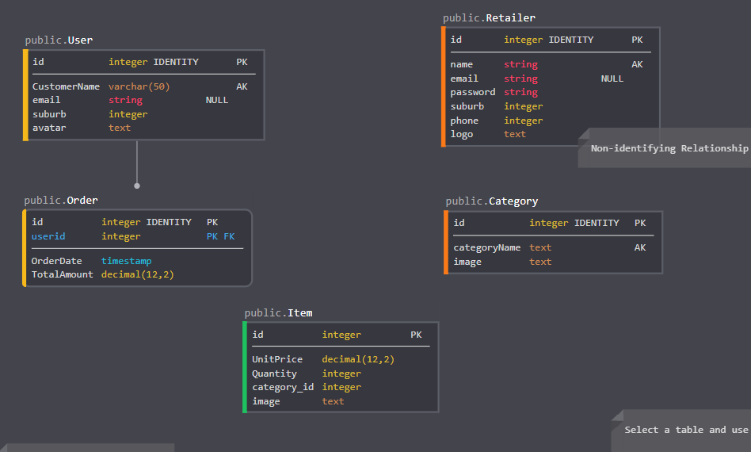

# **Delivree** !
An e-commerce website allowing customers to browse through various local grocers within one app. Users can browse all stores but will need to register to purchase and view their cart.

## Link
https://delivree-estore-3a4z5l.netlify.app/

## Features
- **Dashboard:** A list of all stores!
- **Search:** You can search for any item from various stores
- **Login/Signup**

## Technologies Used
- MERN(MongoDB, Express, React, Node)
- Styled with Bootstrap

## Project Model

## Project Scripts
1. `node install`
2. `npm run start` to run server.
3. Open  http://localhost:8080/
